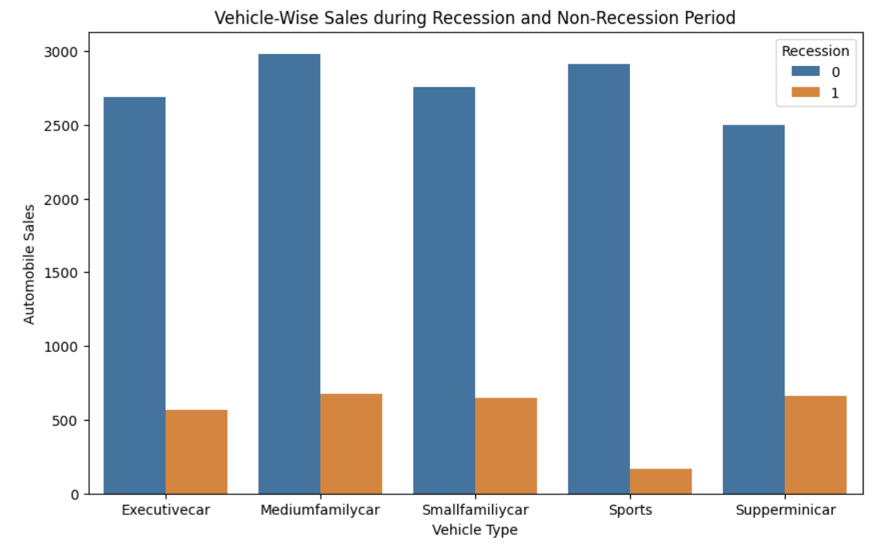
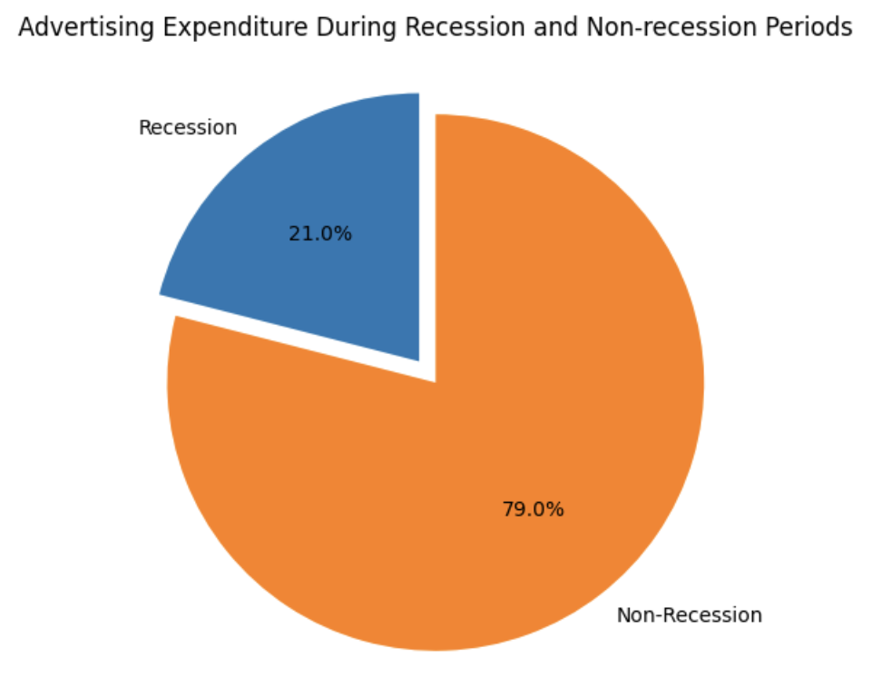
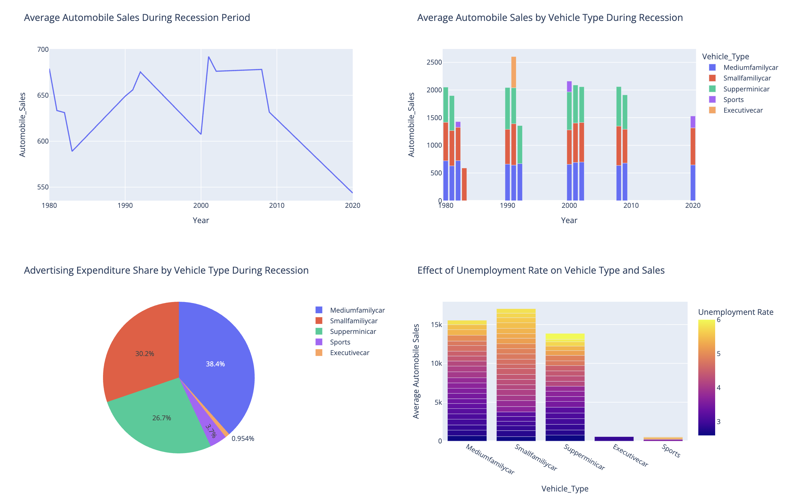
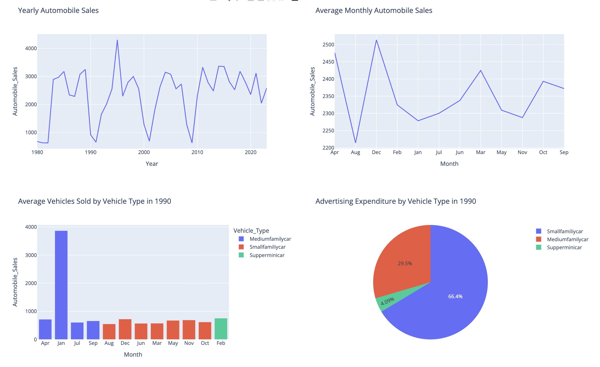

# 📝 Data Visualization IBM Certificate
##  Author: Pol Monné Parera

This repository showcases the hands-on labs i developed as part of the Data Visualization course offered by IBM on Coursera in my path to obtaining the IBM Data Scientist Professional certification they offer on the same site.

## 🧩 Technologies Used
- **Jupyter Notebook** 
- **Python 3**
- **Python Libraries, among them: Matplotlib, Seaborn, Pandas and Dash**

## 📸 Demo Screenshots

Below are some preview images showcasing some of the visualizations developed as part of this course. You can find more execution examples on the demo folder of the project.

### Bar Chart - Final Assignment P1

### Pie Chart - Final Assignment P1

### Recession Report Dashboard - Final Assignment P2

### Yearly Report Dashboard - Final Assignment P2

---

## 📜 Certification
IBM Data Visualization with Python — Coursera (IBM Data Science Professional Certificate Track)
Credential: https://coursera.org/verify/2CI47UYSRNE9

---

⭐ If you found this helpful or interesting, feel free to star the repository!
